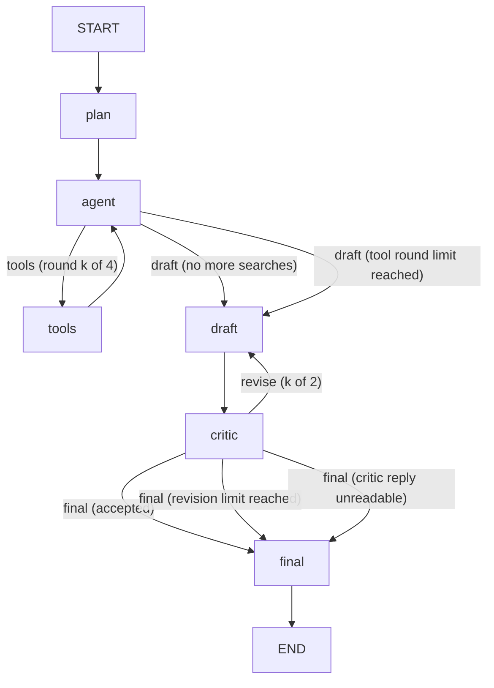

# GraphScout

GraphScout answers a factual question from Wikipedia and lists its sources. You type a question or use the sample. A planner writes search queries. An agent calls two Wikipedia tools in a loop, reads the pages it chooses, and stops when it has enough. A draft writes the answer with numbered citations. A critic accepts the draft or sends it back for up to two revisions. The final answer lists the sources it cites, as links.

**What this showcases:** a LangGraph agent whose tool loop and critic loop are real cycles in a state graph, each bounded and shown as it runs.

A plain chain cannot do this, because the path depends on what the model finds. The agent may need one tool round or four. The critic may accept, or ask for up to two revisions, and each new draft must see the critic's notes. LangGraph.js holds the state, runs the conditional edges and enforces the limits, so each decision is an explicit edge with a label. The run trace shows every visit, which edge was taken and why.

## The graph



- **agent to tools** runs when the model asked for tool calls and fewer than 4 rounds have run. The tools loop back to the agent.
- **agent to draft** runs when the model asked for no tools, or when the 4-round budget is spent. In the second case the agent visit is marked skipped and makes no model call.
- **critic to final** runs when the critic accepts, or when the draft has already been sent back twice.
- **critic to draft** runs when the critic asks for changes and fewer than 2 revisions have been used. The critic's notes go to the next draft.
- A reply the critic cannot read goes to final as "not reviewed", and the answer says so.

| Node | Model | List price per 1M tokens (in / out) | Why this model |
| --- | --- | --- | --- |
| plan | `xiaomi/mimo-v2.6-flash` | $0.14 / $0.28 | Writes one to three short queries. |
| agent | `xiaomi/mimo-v2.6-pro` | $0.44 / $0.87 | Tool calling needs the stronger model. |
| draft | `xiaomi/mimo-v2.6-pro` | $0.44 / $0.87 | Writes cited prose from the sources. |
| critic | `~anthropic/claude-haiku-latest` | $0.10 / $0.50 | Returns a strict JSON verdict. |

Prices were checked on 2026-10-08. Every call sends a `max_tokens` cap (plan 400, agent 800, draft 1200, critic 400) and temperature 0.2.

Sources are the pages the agent read with `wikipedia_page`. Each page gets one number, and a page read twice keeps its number. A search result alone is not a source. The tools are:

- `wikipedia_search` returns up to five titles with snippets.
- `wikipedia_page` returns the first 2,500 characters of plain text and the canonical URL.

A tool that fails, times out or finds nothing adds no source. The loop carries on. Only the first three tool calls in one reply run, and the trace says how many were dropped. Citation markers that name no source are removed from the answer.

## What the page shows

- **Controls**: the question field, the sample question, and the Start research and Stop buttons. The line under them says what the run is doing.
- **Graph**: each box shows its state as a dot and a word, and the running step pulses. Each arrow the run took turns signal colour. The two loops show their bounds before a run and their counts during it.
- **Run totals**: total time, total tokens, total cost, and the models used.
- **Cost**: a cost OpenRouter reports is shown as reported. Otherwise the cost is estimated from the list prices and labelled as estimated. A value that cannot be known shows as not reported. If some model calls have no price, the total is labelled partial and says how many.
- **Answer**: the cited answer, the critic's verdict and notes, and the sources as numbered links. If the draft hit its length limit, the answer carries a notice that it was cut short.
- **Run trace**: one numbered row per node visit, with its status, time in milliseconds, the served model, tokens, and cost.

## Architecture

The browser posts a question to `POST /api/run`, a Netlify Function at `netlify/functions/run.ts`. The function checks the method, the origin, a rate limit of 20 requests a minute per client, the body size and the question (1 to 500 characters). It then starts the graph and streams the run as server-sent events. The graph calls OpenRouter through `netlify/shared/openrouter.ts` and Wikipedia through `netlify/shared/wikipedia.ts`.

- **Key**: `OPENROUTER_API_KEY` is read only on the server. The browser never receives it, and no error message contains a provider body.
- **Budget**: one 25-second budget covers every model and tool call in a run, so the run ends itself before the roughly 30-second cut-off seen on the live Netlify site. Each model call also has a 12-second timeout. Each Wikipedia call has a 6-second timeout.
- **Errors**: each failure becomes a plain message in an error frame, and the stream still ends with `[DONE]`.
- **Checkpointer**: an in-memory checkpointer is created for each request. Nothing is saved between requests.

Source files live in `netlify/shared/graph/` (state, prompts, parsing, tools, nodes, graph assembly and the stream mapping) and `src/` (the page).

## Run locally

```bash
npm ci
npm run dev          # the page on port 5173; /api is proxied to port 8888
npx netlify dev      # the function on port 8888; needs the variables below
npm test
npm run lint
npm run typecheck
npm run build
```

Environment variables, by name only: `OPENROUTER_API_KEY` (required) and `ALLOWED_ORIGINS` (optional, comma separated, added to the built-in list). Tests never reach the network. They blank the key and stub every fetch.

## Live

https://jdgafx-app-11-langgraph-research-agent.netlify.app

## API

`POST /api/run` with the JSON body `{ "question": "..." }`. A success is a `text/event-stream` of frames, one JSON object per `data:` line:

- `node_start`: `node`, `visit`, `ms` (offset from the start of the run).
- `node_end`: `node`, `visit`, `ms` (duration), `status` (`ok`, `failed` or `skipped`), `detail`, and when a model was called, `model`, `servedModel`, `usage`, `cost`, `costSource`.
- `edge`: `from`, `to`, `label`.
- `result`: `answer`, `sources`, `critic`, `path`, `evidenceCount`, `toolRounds`, `revisions`, `truncated`, `totals`, `models`.
- `error`: `message`.

The stream always ends with `data: [DONE]`. A refused request returns JSON `{ "success": false, "error": "..." }` with status 400, 403, 405, 413, 429, 500 or 503. A 500 is an unexpected server error.

## Known limits

- Only English Wikipedia is searched. The agent reads the first 2,500 characters of a page, so a fact further down the article is not seen.
- The critic is a model. It can miss an unsupported claim, and an accepted answer is not proof of correctness.
- If the agent makes no tool call before it reads a page, the draft has no sources. The draft prompt asks the model to say so, but the model may not.
- Every request turns reasoning off. A model can still return an empty reply, and then the run falls back, accepts the draft unreviewed, or reports a plain error.
- The rate limit is kept per warm function instance, so it is not a quota.
- The run budget is 25 seconds. A slow provider ends the run with a timeout message.
- Runs are not saved, so a run cannot be resumed or reopened.
