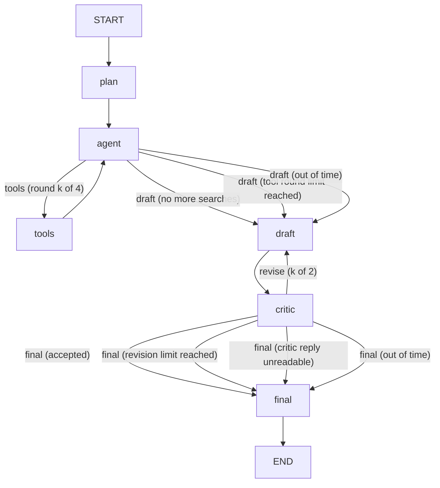

# GraphScout

GraphScout answers a factual question from Wikipedia and lists its sources. You type a question or load one of four examples. A planner writes search queries. An agent calls two Wikipedia tools in a loop, reads the pages it chooses, and stops when it has enough. A draft writes the answer with numbered citations. A critic accepts the draft or sends it back for up to two revisions, and only when it names a concrete fault. The final answer lists the sources it cites, as links. The graph watches the clock: when the time left cannot cover another step, it skips that step and says so on the edge, and a run that is stopped still shows its last draft, labelled.

**What this showcases:** a LangGraph agent whose tool loop and critic loop are real cycles in a state graph, each bounded and shown as it runs.

A plain chain cannot do this, because the path depends on what the model finds. The agent may need one tool round or four. The critic may accept, or ask for up to two revisions, and each new draft must see the critic's issues. The time left decides whether another tool round or another revision is worth starting. LangGraph.js holds the state, runs the conditional edges and enforces the limits, so each decision is an explicit edge with a label. The run trace shows every visit, which edge was taken and why.

## The graph



- **agent to tools** runs when the model asked for tool calls and fewer than 4 rounds have run. The tools loop back to the agent.
- **agent to draft** runs when the model asked for no tools, or when the 4-round budget is spent. In the second case the agent visit is marked skipped and makes no model call.
- **critic to final** runs when the critic accepts, or when the draft has already been sent back twice.
- **critic to draft** runs when the critic says revise, names at least one issue that quotes words really found in the draft or the question, fewer than 2 revisions have been used, and the time left covers a draft and a review. The issues go to the next draft. A revise verdict with no such issue is accepted, and the trace says why.
- **Year gap check in code**: when the question asks how many years apart two events are, the critic step first checks the answer's gap in code (`netlify/shared/graph/yearcheck.ts`, no model call). The number must equal the difference of the two years the sentence names, each year must be in the sources, and a year taken from the start of a range the sources give ("between 1930 and 1931") is sent back to the draft as a revision with the sentence quoted. If the wrong gap is still there after the revisions or for lack of time, the answer is labelled "The year gap is not confirmed by the sources."
- An honest "the sources do not say" draft that cites what was read passes the critic. An issue with no fix text is dropped.
- The draft prompt forbids talk about the review, and the critic is told never to supply a fact: an issue may only point at missing or wrong content, and its fix must come from the sources. As a check behind both, the final step cleans a revised answer. It removes sentences that name the reviewer, the critic, the notes or the previous draft, and uncited sentences that hold a name or a number found in no source and not in the question. The trace row says how many sentences went and why. A first draft is not cleaned. A claim built only from words in the question is not caught.
- A reply the critic cannot read goes to final as "not reviewed", and the answer says so.
- **out of time** edges (agent to draft, critic to final) are taken when the time left is below what the next step needs. The node detail says how many seconds were left, for example "Time left 6 s: no more searches. Drafting with what has been read." A skipped review leaves the answer labelled "Unreviewed: the time limit ended the review."

Every node uses one model, `anthropic/claude-haiku-5.5`, named once as `NODE_MODEL` in `netlify/shared/models.ts`. Its list price is $0.10 in and $0.50 out per 1M tokens, checked on 2026-10-09. Haiku 5.5 rejects a temperature, so no call sends one. Reasoning is off on every call.

| Node | What it does | Reply cap | p50 / p95 (ms) |
| --- | --- | --- | --- |
| plan | Writes one to three short queries as JSON. | 400 tokens | 1,644 / 3,769 |
| agent | Calls the Wikipedia tools. It must call a tool until it has read one page (`tool_choice: required`). | 800 tokens | 1,436 / 2,652 |
| draft | Writes cited prose from the numbered sources. | 1,200 tokens | 1,689 / 3,576 |
| critic | Lists its checks, then returns a verdict and issues that quote the draft, as JSON. Accept is the default. | 400 tokens | 1,829 / 2,923 |

The latency figures are from 54 local runs through OpenRouter on 2026-10-09 (54 plan, 163 agent, 77 draft and 77 critic calls). The slowest agent call took 14.8 s: it hit the 12 s limit and its retry succeeded. The deployed function is slower or faster by what its network adds, so the time thresholds below keep a margin.

Sources are the pages the agent read with `wikipedia_page`. Each page gets one number, and a page read twice keeps its number. A search result alone is not a source. The tools are:

- `wikipedia_search` returns up to five titles with snippets.
- `wikipedia_page` returns the first 2,500 characters of plain text and the canonical URL.

A tool that fails, times out or finds nothing adds no source. The loop carries on. Only the first three tool calls in one reply run, and the trace says how many were dropped. Citation markers that name no source are removed from the answer.

## What the page shows

- **Controls**: the question field, the Start research and Stop buttons, and four example questions that each fill the field. A question over 500 characters is not cut: the count turns red and says how many to remove. The line under them says what the run is doing.
- **Examples**: a quick lookup (Lisbon's World Exposition), a question that follows a link from one page to the next (the novel behind Blade Runner), a comparison of two pages with a sum (the Eiffel Tower and the Empire State Building), and a three-part question about one person (the first woman to win a Nobel Prize). Each has an answer on English Wikipedia. The path a run takes is decided by the models at run time, so an example may take another path.
- **Graph**: each box shows its state as a dot and a word, and the running step pulses. Each arrow the run took turns signal colour. The two loops show their bounds before a run and their counts during it.
- **Run totals**: total time, total tokens, total cost, and the models used.
- **Cost**: a cost OpenRouter reports is shown as reported. Otherwise the cost is estimated from the list prices and labelled as estimated. A value that cannot be known shows as not reported. If some model calls have no price, the total is labelled partial and says how many.
- **Answer**: the cited answer, the critic's verdict and issues, and the sources as numbered links. If the draft hit its length limit, the answer carries a notice that it was cut short. If the run ended early, a notice says how far the review got: "Unreviewed: the time limit ended the review.", "Reviewed once: the critic asked for changes, but the time limit ended the revision. This is the reviewed draft.", or, with no draft, "No answer was written" and the pages read.
- **Run trace**: one numbered row per node visit, with its status, time in milliseconds, the served model, tokens, and cost.

## Architecture

The browser posts a question to `POST /api/run`, a Netlify Function at `netlify/functions/run.ts`. The function checks the method, the origin, a rate limit of 20 requests a minute per client, the body size and the question (1 to 500 characters). It then starts the graph and streams the run as server-sent events. The graph calls OpenRouter through `netlify/shared/openrouter.ts` and Wikipedia through `netlify/shared/wikipedia.ts`.

- **Key**: `OPENROUTER_API_KEY` is read only on the server. The browser never receives it, and no error message contains a provider body.
- **Budget**: one 25-second budget covers every model and tool call in a run, so the run ends itself before the roughly 30-second cut-off seen on the live Netlify site. Each model call also has a 12-second timeout. Each Wikipedia call has a 6-second timeout. Each limit is a timer that aborts the request and also ends the wait, body read included, so a reply that stalls after its headers is cut too (`netlify/shared/limit.ts`). If the run has not returned 2 seconds after its budget, the stream is closed with the budget message anyway. The messages differ: "The AI provider did not answer in time." is the provider's own timeout, and "The run reached its time limit before this step finished." is the run budget.
- **Time-aware steps**: the run carries its deadline, and each step has a need in `STEP_NEEDS_MS` in `netlify/shared/models.ts` (plan 4 s, agent 3 s, tools 1.5 s, draft 4 s, critic 3.5 s: the measured p95, rounded up to the next half second). The agent skips its next turn when a page is read and the time left is below an agent turn, a draft and a review. It routes to the draft instead of another tool round when the time left is below the round and what follows it. The critic is skipped when under its need, and a revision is not started when under a draft and a review. A model call that times out on its own limit or fails to connect is tried once more, only when the time left covers that step again and what must follow.
- **A stopped run keeps its work**: when a step fails or the budget ends the run, the last saved state is read back from the checkpointer. With a draft, the result carries that draft and its cited sources with an `ending` that says what was skipped. With no draft but pages read, it lists the pages and says no answer was written. With neither, it is an error frame. The step that was running gets a failed `node_end` frame with its real duration.
- **Errors**: each failure that leaves nothing to show becomes a plain message in an error frame, and the stream still ends with `[DONE]`.
- **Checkpointer**: an in-memory checkpointer is created for each request. Its saved state is read back for the result and for a stopped run. Nothing is saved between requests.

- **Heartbeat and run log**: the stream starts with a `run_start` frame holding an 8-character run id, and sends a comment line (`: ping`) every 5 seconds until it closes, which keeps proxies from idling it. The page ignores the comment for display but counts it as a byte. The function logs one line when a run starts and one when it ends (`GraphScout: run end {runId, outcome, totalMs, frames}`, outcome being `result:complete`, `result:partial`, `result:no_answer`, `error`, `hard-stop` or `cancelled`), with no question text. The page shows the run id above the trace, so a report can quote it and a log can tell a frozen function from a held stream.
- **Page watchdog**: if the server sends no byte for 30 seconds, or a run lasts more than 60 seconds, the page stops waiting and says "The server stopped responding." with the retry line. Pressing Stop stays silent.

Source files live in `netlify/shared/graph/` (state, prompts, parsing, tools, nodes, graph assembly and the stream mapping) and `src/` (the page).

## Run locally

```bash
npm ci
npm run dev          # the page on port 5173; /api is proxied to port 8888
npx netlify dev      # the function on port 8888; needs the variables below
npm test
npm run lint
npm run typecheck
npm run build
```

Environment variables, by name only: `OPENROUTER_API_KEY` (required) and `ALLOWED_ORIGINS` (optional, comma separated, added to the built-in list). Tests never reach the network. They blank the key and stub every fetch.

## Live

https://jdgafx-app-11-langgraph-research-agent.netlify.app

## API

`POST /api/run` with the JSON body `{ "question": "..." }`. A success is a `text/event-stream` of frames, one JSON object per `data:` line:

- `run_start`: `runId`, the first frame of every run.
- `node_start`: `node`, `visit`, `ms` (offset from the start of the run).
- `node_end`: `node`, `visit`, `ms` (duration), `status` (`ok`, `failed` or `skipped`), `detail`, and when a model was called, `model`, `servedModel`, `usage`, `cost`, `costSource`.
- `edge`: `from`, `to`, `label`.
- `result`: `answer`, `sources`, `critic`, `ending`, `path`, `evidenceCount`, `toolRounds`, `revisions`, `truncated`, `totals`, `models`. `ending` is `{ kind, message }`: `complete`, `partial` (the last draft of a run that stopped early or skipped a step for time) or `no_answer` (`answer` is empty and `sources` lists the pages read).
- `checkpoints`: `items`, sent after the result of a fresh run: each has `kind` (`plan` or `critic`), `visit`, a signed `token`, and the fields to show (`queries`, `draft`, `sources`).
- `error`: `message`. Sent only when the run stopped with no draft and no page read.

`POST /api/resume` with `{ "token", "edit" }` (`edit` is `{ "queries": [...] }` for a plan token or `{ "notes": "..." }` for a critic token) streams the same frames. It first sends a `node_end` for every kept step with `reused: true` (the edited step carries `edited: true`), and its `result` carries `fork: { kind, visit, reused, rerun }` with totals for the re-run only.

The stream always ends with `data: [DONE]`. A refused request returns JSON `{ "success": false, "error": "..." }` with status 400, 403, 405, 413, 429, 500 or 503. A 500 is an unexpected server error.

## Rewind and edit a checkpoint

LangGraph checkpoints the state after each node. After a run, the page offers the plan and each critic visit (as long as the critic can still send the draft back). Pick one, edit the field that matters there, and only the steps after it run again, against live Wikipedia and the real model:

- **Plan**: edit the 1 to 3 search queries (120 characters each). The agent searches with yours, and every step after the plan runs again.
- **Critic**: write a note (300 characters) that replaces the critic's review. The draft is rewritten with it, the new draft is reviewed, and the answer is finalised. The steps up to the first draft are reused with their original times.

The page shows the original and the new answer side by side with a word diff, the sources gained and lost, and a trace where reused steps are marked "Reused" (with their original time) and the edited step "Your edit". Totals and the readout cover only the re-run.

**Where the checkpoint lives.** The server sends each checkpoint to the page as a signed token and the page sends it back to `POST /api/resume` with the edit. The token is the state (question, queries, pages read, draft, trace) signed with HMAC-SHA256 under a key derived from the server's model key, with a two hour expiry. A stateless token needs no new dependency or storage, works on any function instance, and stores no question text on the server. Netlify Blobs would add a dependency, a store to clean up, and writes that do not run under `vite preview`. The signature matters because the pages in the token are what the model is told to trust: the page can read the token but cannot change a page or the draft. A token is 1 to 11 KB; the resume body cap is 96 KB.

**What the server checks.** The token (signature, expiry, shape, page urls and sizes), then the edit: query count and length, note length, no control characters, and a screen for text that talks to the model about its rules ("ignore previous instructions", "system prompt"). The edit is only ever placed in a user message, never in a system prompt. A bad edit is a 400 with the reason, before any model call. The resumed run keeps the live rules: time-aware steps, the draft kept if time runs out, a per-call limit with one retry, the hard stop and the page watchdog.

## Known limits

- Only English Wikipedia is searched. The agent reads the first 2,500 characters of a page, so a fact further down the article is not seen.
- The critic is a model. It can miss an unsupported claim, and an accepted answer is not proof of correctness.
- The agent must call a tool until it has read one page, and is told to read a page for each person, place or work the question names. It can still read a page that does not hold the fact: the first 2,500 characters of Bedřich Smetana's page say "Czech composer" but not where he was born, so a two-hop question about his country's capital river ends with an honest "the sources do not state where he was born" rather than a guess. A critic issue does not send the run back to the agent, because the same pages would be read again. The draft prompt asks the model to say when the sources do not answer, but the model may not.
- Every request turns reasoning off. A model can still return an empty reply, and then the run falls back, accepts the draft unreviewed, or reports a plain error.
- The rate limit is kept per warm function instance, so it is not a quota.
- The run budget is 25 seconds. A slow provider can make the graph skip steps, and a run that cannot draft in time ends with the pages read and no answer. Time left decides, so the same question can take different paths on different days.
- Runs are not saved on the server. A finished run hands the page a signed checkpoint for the plan and for each critic visit it could still send back, and that is the only way to resume: a run you left, or one older than two hours, cannot be rewound.
- Rewind covers two points, the plan (its search queries) and the critic (a note that replaces its review). The agent's own tool calls cannot be edited. A rewind runs on live pages, so a different answer may come from the web or the model changing, not only from your edit. A resumed run has its own 25 second budget and can end partial like any run.
