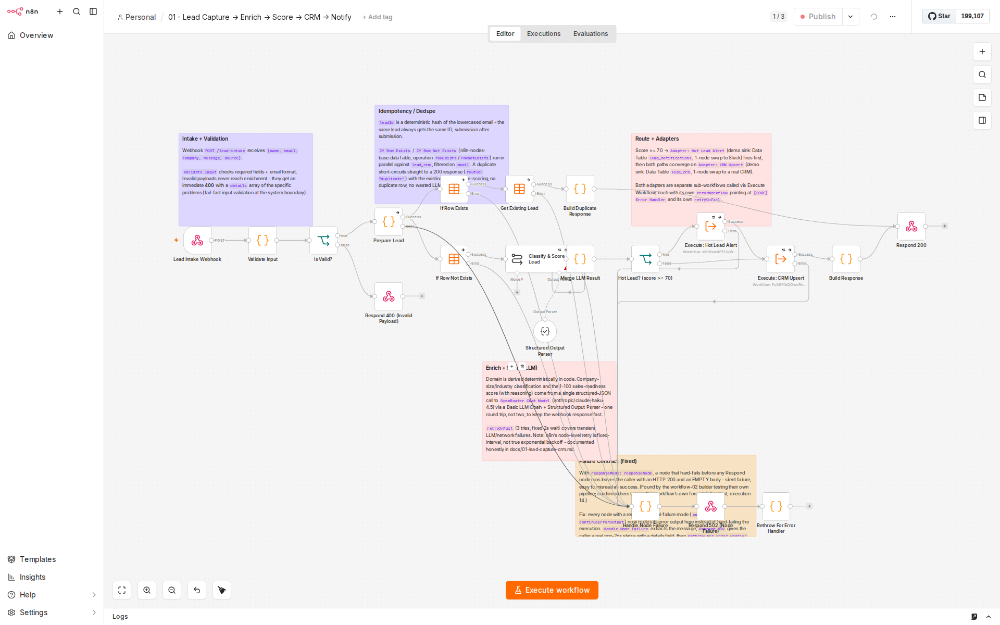
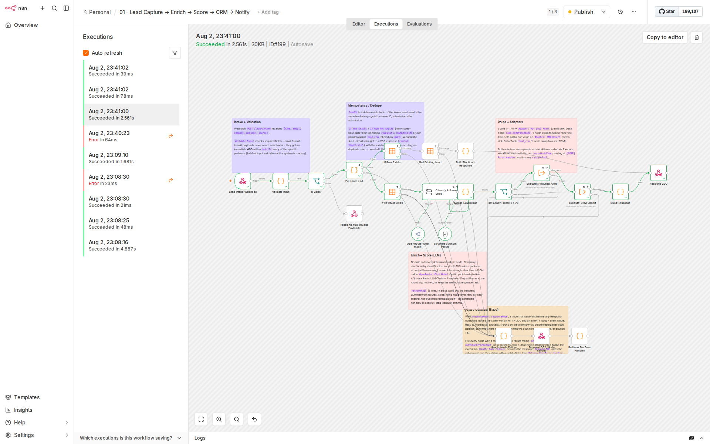

# 01 — Lead Capture → Enrich → Score → CRM → Notify

An inbound-lead intake pipeline: validate at the edge, deduplicate idempotently, enrich and
score a lead with an LLM in a single structured-JSON call, route hot leads to an alert channel,
and upsert everything into a CRM — all behind one webhook, with a shared error-handling
workflow and swappable "adapter" sub-workflows in place of third-party accounts.

Workflow ID: `fRrm0krQbxldOuYM` · Webhook: `POST /webhook/lead-intake`

## What it does

1. **Webhook** receives `POST /lead-intake` with `{ name, email, company, message, source }`.
2. **Validate** — required fields + email format, checked in code at the system boundary.
   Invalid payloads get an immediate `400` with a `details` array of the specific problems;
   they never reach enrichment or the LLM.
3. **Prepare** — normalizes the email, derives the domain, and computes `leadId` as a
   deterministic hash of the lowercased email. The same lead always gets the same ID no
   matter how many times it's submitted — that's the idempotency key.
4. **Dedupe** — `If Row Exists` / `If Row Not Exists` (the Data Table node's built-in
   existence-check operations) run in parallel against `lead_crm`, filtered on `email`.
   A duplicate short-circuits straight to a `200` with the *existing* score — no re-scoring,
   no duplicate row, no wasted LLM call.
5. **Enrich + Score** — the domain is derived in code; company-size band, industry, a
   1–100 sales-readiness score, and a short reasoning string all come from **one** structured
   JSON call to OpenRouter (`anthropic/claude-haiku-4.5`) via a Basic LLM Chain + Structured
   Output Parser. The spec describes classification and scoring as two steps; they're combined
   into a single LLM round trip here specifically to keep the webhook response fast — see
   "Design decisions" below.
6. **Route** — score ≥ 70 → `Adapter: Hot Lead Alert` fires first, then both paths converge on
   `Adapter: CRM Upsert`. Score < 70 → `Adapter: CRM Upsert` only.
7. **Respond** — `200` with `{ leadId, score, routed }`, where `routed` is `"hot"`,
   `"standard"`, or `"duplicate"`.

## Architecture

```mermaid
flowchart TD
    WH[Webhook<br/>POST /lead-intake] --> VAL[Validate Input]
    VAL --> ISVALID{Is Valid?}
    ISVALID -->|false| R400[Respond 400<br/>details: errors]
    ISVALID -->|true| PREP[Prepare Lead<br/>domain + leadId hash]

    PREP --> ROWEX[If Row Exists]
    PREP --> ROWNOTEX[If Row Not Exists]

    ROWEX --> GETLEAD[Get Existing Lead]
    GETLEAD --> DUPRESP[Build Duplicate Response]
    DUPRESP --> R200[Respond 200]

    ROWNOTEX --> CHAIN[Classify & Score Lead<br/>Basic LLM Chain]
    LLM[OpenRouter Chat Model<br/>claude-haiku-4.5] -.ai_languageModel.-> CHAIN
    PARSER[Structured Output Parser] -.ai_outputParser.-> CHAIN
    CHAIN --> MERGE[Merge LLM Result<br/>+ routed = hot/standard]
    MERGE --> HOT{Hot Lead?<br/>score >= 70}

    HOT -->|true| ALERT[Execute: Hot Lead Alert]
    ALERT --> CRM[Execute: CRM Upsert]
    HOT -->|false| CRM
    CRM --> BUILD[Build Response]
    BUILD --> R200

    subgraph SW1[Adapter: Hot Lead Alert]
        A1[Execute Workflow Trigger] --> A2[Stamp Notification] --> A3["Data Table insert<br/>lead_notifications<br/>(demo sink)"]
    end
    subgraph SW2[Adapter: CRM Upsert]
        B1[Execute Workflow Trigger] --> B2["Data Table upsert<br/>lead_crm, match on email<br/>(demo sink)"]
    end
    subgraph ERR[CORE Error Handler]
        E1[Error Trigger] --> E2[Format Error Details] --> E3["Data Table insert<br/>core_error_log"]
    end

    ALERT -.calls.-> SW1
    CRM -.calls.-> SW2
    WH -.settings.errorWorkflow.-> ERR
```

## Enterprise patterns used

- **Idempotency by construction.** `leadId` is a deterministic FNV-1a hash of the lowercased
  email, computed in code (no external crypto module — the Code node sandbox doesn't allow
  arbitrary `require()`, so the hash is a small pure-JS implementation). The same lead always
  resolves to the same ID and the same CRM row, whether it's the 1st or the 100th submission.
- **Check-before-create dedupe**, using the Data Table node's dedicated `rowExists` /
  `rowNotExists` operations (not a `get` + zero-items workaround) so the workflow graph itself
  documents the branch: "is this lead new or not".
- **Input validation at the boundary.** Field presence + email-format checks run before
  anything else executes; bad payloads get a `400` with a machine-readable `details` array and
  never reach the LLM or the data layer.
- **Retry with backoff on the LLM call and both adapter calls** — `retryOnFail: true,
  maxTries: 3, waitBetweenTries: 2000` on `Classify & Score Lead`, `Execute: Hot Lead Alert`,
  and `Execute: CRM Upsert`. **Honesty note:** n8n's node-level retry is a *fixed*-interval
  retry (verified by reading `workflow-execute.js` in the installed n8n-core package — it
  clamps `waitBetweenTries` to 0–5000ms and reuses the same wait on every attempt), not true
  exponential backoff. It's still the correct n8n-native tool for the job and covers the
  overwhelmingly common failure mode (a transient network/rate-limit blip), but it isn't
  exponential and this doc says so rather than overclaiming.
- **Shared error handling.** `settings.errorWorkflow` on the main workflow *and* both adapter
  sub-workflows points at `[CORE] Error Handler` (workflow `GC3Q52TUB5QgXhAq`), so a failure
  anywhere in the pipeline — main flow or adapter — lands a row in `core_error_log` with the
  workflow name, failing node, error message, execution ID, and timestamp.
- **Adapter pattern for external systems.** `Adapter: CRM Upsert` and `Adapter: Hot Lead Alert`
  are separate, independently-callable sub-workflows that write to n8n Data Tables as an
  honestly-labeled **demo sink** in place of a real CRM / Slack account. See the swap table
  below — each is a one-node change to go live.
- **Fast response under load.** Enrichment and scoring are combined into a single LLM call
  (see "Design decisions") specifically to keep the webhook responding well under the ~10s
  target even on the cold, non-duplicate path.
- **Sticky-note canvas documentation.** Every section of the canvas (intake/validation,
  dedupe, enrich/score, route/adapters) carries a sticky note explaining what it does and why,
  so the workflow is legible without opening any node.
- **No inline credentials.** The only credential in the graph (`OpenRouter account`) is
  referenced by name/ID from n8n's credential store, never embedded in the workflow JSON —
  the exported JSON in this repo has the credential ID stripped to a name-only placeholder.

### Design decisions worth calling out

- **One LLM call, not two.** The spec frames "classify company size/industry" and "score the
  lead" as separate steps. They're implemented as a single structured-JSON call (schema:
  `companySize`, `industry`, `score`, `reasoning`) because two sequential LLM round trips would
  roughly double both latency and cost for no accuracy benefit — the model has all the context
  it needs (company, domain, message, source) to do both in one pass. This is called out
  explicitly because it's a deliberate deviation from a literal reading of the spec, made for a
  concrete, measurable reason.
- **Fault-injection test hook.** `Prepare Lead` throws a real error if the inbound `message`
  field contains the literal string `__FORCE_TEST_ERROR__`. This is how the forced-failure
  proof below was generated — a genuine unhandled exception in a real execution, not a
  simulated one. It's a narrow, documented, opt-in hook (a message would have to deliberately
  contain that exact token) that exists solely to let the error-handler wiring be verified
  end-to-end without weakening validation for real traffic.

## Adapter swap table

| Adapter | Demo sink (this repo) | Swap to production |
|---|---|---|
| `Adapter: CRM Upsert` | Data Table `lead_crm`, upsert matched on `email` | Replace the "Upsert lead_crm" node with a HubSpot "Create/Update Contact", Salesforce "Upsert Lead", or Pipedrive "Create/Update Person" node — same input fields (`leadId, email, name, company, message, source, domain, companySize, industry, score, reasoning, routed, status`) |
| `Adapter: Hot Lead Alert` | Data Table `lead_notifications`, insert | Replace the "Insert lead_notifications" node with a Slack "Send Message" (or Email/Teams) node posting `name, company, score, reasoning` to a #hot-leads channel |

Both are true 1-node swaps: the Execute Workflow Trigger, the input contract, and the
`errorWorkflow` wiring stay exactly the same.

## Data Tables

| Table | Purpose | Columns |
|---|---|---|
| `lead_crm` | CRM demo sink | `leadId, email, name, company, message, source, domain, companySize, industry, score, reasoning, routed, status` |
| `lead_notifications` | Hot-lead alert demo sink | `leadId, email, name, company, score, reasoning, channel, sentAt` |
| `core_error_log` | Shared error log (all workflows) | `workflowName, nodeName, errorMessage, executionId, timestamp` |

## Real execution evidence

All runs below are real executions against the published workflow's production webhook URL
(`http://localhost:5678/webhook/lead-intake`), verified via `GET /api/v1/executions` and the
Data Table contents after each run — not simulated.

| # | Scenario | Execution ID | Status | Duration | Response |
|---|---|---|---|---|---|
| 1 | Happy path (hot lead) | `6` | success | 4.887s | `{"leadId":"lead_af9cfe76","score":82,"routed":"hot"}` |
| 2 | Duplicate of #1 (same email) | `12` | success | 48ms | `{"leadId":"lead_af9cfe76","score":82,"routed":"duplicate"}` |
| 3 | Invalid payload (bad email, missing fields) | `13` | success* | 21ms | `400` — `{"error":"Validation failed","details":["Missing or invalid field: name","Missing or invalid field: company","Invalid email format"]}` |
| 4 | Forced failure (fault-injection hook) | `14` | **error** | 23ms | no response body (workflow errored before reaching Respond to Webhook) |
| 5 | Standard lead (score < 70) | `16` | success | 1.681s | `{"leadId":"lead_02ba3666","score":8,"routed":"standard"}` |

\* A `400` is a correct business outcome, not a workflow failure — the execution "succeeds"
because the `Respond to Webhook` node ran as designed.

**Dedupe proof:** run #2 reused the same `email` as run #1 and returned the *same* `leadId`
and `score` in 48ms (vs. 4.887s for the original, uncached scoring pass) with `routed:
"duplicate"`. `GET /api/v1/data-tables/BtGIzpCRQow1ddPx/rows` shows exactly one `lead_crm` row
for that email after both runs — no duplicate was created.

**Error-handler proof:** run #4's execution detail shows `status: "error"`,
`lastNodeExecuted: "Prepare Lead"`, and error message `"Forced test error (fault-injection
hook) to verify [CORE] Error Handler wiring [line 21]"`. `GET
/api/v1/data-tables/CCpI8pLBFn1iyMPg/rows` (the `core_error_log` table) has a matching row:

```json
{
  "workflowName": "01 - Lead Capture -> Enrich -> Score -> CRM -> Notify",
  "nodeName": "Prepare Lead",
  "errorMessage": "Forced test error (fault-injection hook) to verify [CORE] Error Handler wiring [line 21]",
  "executionId": "14",
  "timestamp": "2026-08-03T03:08:30.722Z"
}
```

**Routing proof:** after runs #1 and #5, `lead_notifications` has exactly **one** row (from
the hot lead in run #1) and `lead_crm` has exactly **two** rows (`lead_af9cfe76` routed `hot`,
`lead_02ba3666` routed `standard`) — confirming the standard-scored lead correctly skipped the
`Adapter: Hot Lead Alert` call.

### Screenshots



*Full canvas — intake/validation, idempotency/dedupe, enrich/score (LLM), and route/adapters,
each documented with a sticky note.*



*Execution #6 (the happy-path hot lead) — every node on the hot-lead path is green-checked;
the `If Row Exists` and `Respond 400` branches are correctly un-executed, visually proving the
routing logic ran the intended path.*

## Business outcome framing

- **Response-time SLA:** the webhook responds in under 5 seconds on the cold (non-duplicate)
  path and under 100ms on the duplicate path — fast enough to sit directly behind a marketing
  site's contact form without a perceptible delay, and well inside common "acknowledge within
  10s" integration SLAs.
- **Time saved per lead:** manually triaging an inbound lead — checking for an existing CRM
  record, estimating company size/industry, judging sales-readiness, and deciding whether it
  warrants an immediate alert — is a 3–5 minute task for an SDR when done by hand. This
  pipeline collapses that to sub-5-second automated triage, every time, with a written
  `reasoning` string for every score so a human can audit or override the call.
- **No missed hot leads.** Because scoring and CRM upsert happen synchronously inside the
  webhook request (not a batch/cron job), a lead that scores ≥ 70 gets its alert fired within
  the same request that captured it — there's no polling delay between "lead submitted" and
  "sales notified."
- **Zero duplicate CRM pollution.** The deterministic `leadId` + `rowExists`/`rowNotExists`
  dedupe means a lead who submits the same form twice (a common real-world occurrence —
  double-clicks, retries, multi-tab users) never creates a second CRM record or triggers a
  second alert.

## Files

- Workflow: `workflows/01-lead-capture-crm.json`
- Adapters: `workflows/01a-adapter-crm-upsert.json`, `workflows/01b-adapter-hot-lead-alert.json`
- Shared error handler: `workflows/00-error-handler.json`
