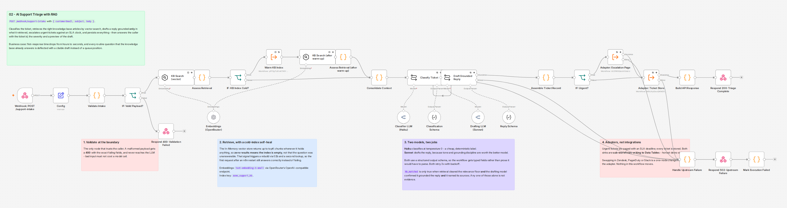
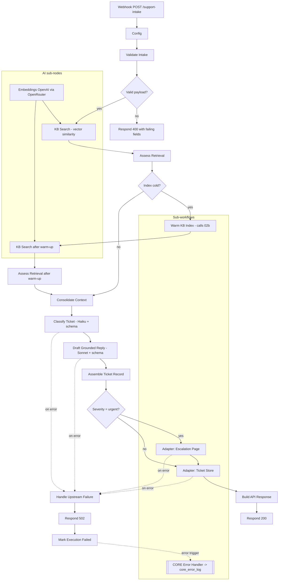
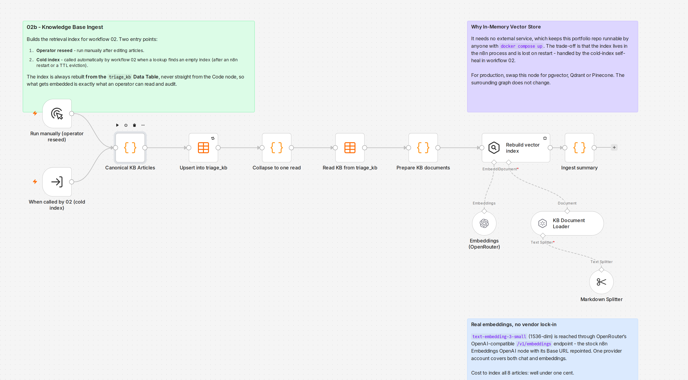
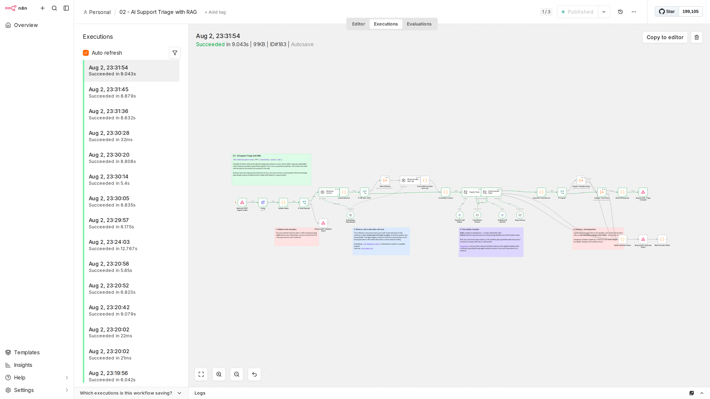

# 02 - AI Support Triage with a RAG knowledge base

Accepts an inbound support ticket over HTTP, classifies it, retrieves the knowledge base
articles that actually answer it by vector search, drafts a reply grounded **only** in what it
retrieved, escalates urgent tickets against an SLA clock, persists everything, and answers the
caller with a ticket id, a severity and a preview of the draft.

Built on n8n 2.32.7. Every claim on this page is backed by a real execution id on a live
instance; nothing here is a mock or a screenshot of an intended design.



## Why this is worth automating

Support teams lose most of their first-response time to a triage step that is almost entirely
mechanical: read the ticket, decide how bad it is, find the article that answers it, and write
the same reply someone already wrote last week.

| Measure | Manual triage | This workflow |
| --- | --- | --- |
| First response time | Minutes to hours, business hours only | 8.6 to 9.1 seconds end to end, continuously (three consecutive warm-index runs measured at 8.63s, 8.88s and 9.04s; executions 179, 181, 183) |
| Article lookup | Agent searches the help centre by memory | Vector search over the whole knowledge base, every ticket, with a relevance score |
| Deflection | Depends on the agent knowing the article exists | Every ticket that the knowledge base can answer arrives with a citable draft attached |
| Urgent detection | Whoever happens to read the queue first | Classified on arrival, paged immediately with an SLA deadline stamped by the automation |
| Consistency | Varies per agent and per day | One prompt, one policy, one severity rubric |

The important design decision is that this workflow **drafts, it does not send**. The reply lands
in the ticket record for a human to approve. That keeps a person accountable for what the
customer reads while removing the part of the job that was never judgement in the first place.

## Architecture



## API contract

`POST http://localhost:5678/webhook/support-intake`

```json
{
  "customerEmail": "dana@northwind.example",
  "subject": "Why was I charged twice this month?",
  "body": "Our invoice this month shows the normal plan fee and then a second charge..."
}
```

**200** - triaged successfully:

```json
{
  "ticketId": "TKT-166",
  "severity": "high",
  "intent": "billing_dispute",
  "sentiment": "neutral",
  "kbMatched": true,
  "sources": ["Understanding Your Acme Analytics Invoice", "Refunds and Proration Policy"],
  "topRelevanceScore": 0.6153,
  "draftPreview": "Hello, thank you for reaching out before filing a dispute...",
  "escalated": false,
  "slaDueAt": null,
  "stored": true,
  "receivedAt": "2026-08-03T03:24:03.298Z"
}
```

**400** - the payload failed validation. The response names every failing field rather than the
first one, so a caller fixes its integration in one round trip:

```json
{
  "error": "validation_failed",
  "message": "Request body failed validation.",
  "details": [
    { "field": "customerEmail", "message": "must be a valid email address" },
    { "field": "subject", "message": "is required" }
  ],
  "expected": { "customerEmail": "string (email)", "subject": "string", "body": "string" }
}
```

**502** - the ticket was accepted but a dependency (model provider or sink) failed:

```json
{
  "error": "upstream_dependency_failed",
  "message": "The ticket was accepted but could not be triaged. It has not been lost - this execution is recorded in core_error_log for replay.",
  "ticketId": "TKT-121",
  "failedNode": "Classify Ticket",
  "detail": "Bad request - please check your parameters",
  "executionId": "121"
}
```

Validation happens before any model call, so a malformed request never costs an LLM token.

## The knowledge base

Eight support articles for a fictional SaaS, "Acme Analytics". They are seeded by
[02b] Support KB Ingest into the `triage_kb` Data Table, then embedded into the vector index.
`triage_kb` is the durable, operator-inspectable copy, and the index is always rebuilt **from
the table**, never straight from code, so what gets embedded is exactly what an operator can
read and audit.

| article_id | Title | Category |
| --- | --- | --- |
| kb-billing-invoice | Understanding Your Acme Analytics Invoice | Billing |
| kb-sso-setup | Setting Up SAML Single Sign-On | Security and Access |
| kb-api-rate-limits | API Rate Limits and Quotas | Developer and API |
| kb-data-export | Exporting Your Data: CSV, S3 and Warehouse Sync | Data |
| kb-refunds-policy | Refunds and Proration Policy | Billing |
| kb-incident-status | Service Incidents and the Status Page | Reliability |
| kb-plan-tiers | Plan Tiers and Feature Comparison | Plans |
| kb-onboarding | Onboarding: Your First 14 Days Checklist | Onboarding |

Two of the eight are deliberately both about billing. A keyword matcher tends to collapse those
two together; the retrieval proof below shows the vector search separating an invoice-breakdown
question from a refund question.



## Retrieval: a real vector path, not a keyword stand-in

Embeddings are real. `text-embedding-3-small` (1536 dimensions) is reached through OpenRouter's
OpenAI-compatible `/v1/embeddings` endpoint, using the stock n8n **Embeddings OpenAI** node with
its Base URL repointed to `https://openrouter.ai/api/v1`. One provider account therefore covers
both chat and embeddings.

This was worth checking rather than assuming: OpenRouter does not list embedding models in its
`/models` response, so it looks unsupported. A direct probe of the endpoint returned a genuine
1536-dimension vector with batching and a cost of roughly 0.0000002 USD per call, which is what
made the vector path viable. The keyword or LLM-rerank fallback was not needed.

Documents are one chunk per article (chunk size 1500, overlap 120, markdown-aware splitter), so
a citation always points at a whole article rather than a fragment. Each document is prefixed
with its title, category and keywords before embedding, because real support tickets are often
terse ("SSO", "429") and body text alone under-retrieves for them.

### Tuning the relevance floor from measured data

`minRelevanceScore` decides which retrieved chunks the drafting model is allowed to see. It was
set from measurement, not taste. Across 14 on-topic probes and 5 off-topic probes:

| Question type | Observed top-1 cosine score |
| --- | --- |
| On topic (answerable from the knowledge base) | 0.4812 to 0.6172 |
| Off topic (nothing in the knowledge base answers it) | 0.1373 to 0.3882 |

The floor sits at **0.42** - inside the gap, but deliberately nearer the off-topic ceiling than
the on-topic floor. The two errors are not symmetric: a weak chunk that slips through is still
caught by the drafting model's `grounded` flag, whereas a good chunk wrongly filtered out is an
answer the customer never receives. An earlier value of 0.30 was measurably too low (it let a
0.3401 "Plan Tiers" chunk into a billing question's context) and 0.45 left only 0.03 of headroom
below the lowest real question, so 0.42 is the value the data supports.

### Retrieval correctness proof

One probe per article, phrased the way a customer would ask rather than by quoting the article.
**8 of 8 retrieved the correct article as the top citation.**

| Probe question (abbreviated) | Expected article | Top cited article | Score | Correct |
| --- | --- | --- | --- | --- |
| "Our bill came in 40 percent above last month, where is the breakdown?" | Invoice | Understanding Your Acme Analytics Invoice | 0.5658 | yes |
| "Okta login fails with unrecognised assertion subject" | SSO | Setting Up SAML Single Sign-On | 0.5753 | yes |
| "Our ingestion service started getting HTTP 429" | API limits | API Rate Limits and Quotas | 0.6157 | yes |
| "We want raw events landing in our own warehouse" | Data export | Exporting Your Data: CSV, S3 and Warehouse Sync | 0.6172 | yes |
| "We paid annually four months ago, can we get a refund?" | Refunds | Refunds and Proration Policy | 0.5400 | yes |
| "Where do you publish service health during an incident?" | Incidents | Service Incidents and the Status Page | 0.5732 | yes |
| "We are on Team and need SAML plus 12+ months history" | Plan tiers | Plan Tiers and Feature Comparison (+ SSO) | 0.5348 | yes |
| "Created a workspace yesterday, what order should we set up?" | Onboarding | Onboarding: Your First 14 Days Checklist | 0.5907 | yes |

The billing pair separated correctly: the invoice-breakdown question cited the invoice article,
the refund question cited the refunds article.

Off-topic controls, all three correctly refused with `kbMatched: false` and an empty `sources`:

| Probe | Top score | Result |
| --- | --- | --- |
| "Do you sponsor local sports teams?" | 0.3882 | no match, graceful refusal |
| "Best way to cook a brisket?" | 0.1373 | no match, graceful refusal |
| "Are you hiring backend engineers?" | 0.2506 | no match, graceful refusal |

`kbMatched` is only true when three independent things agree: retrieval cleared the relevance
floor, the drafting model set `grounded: true`, and it named at least one source. Any one of
those alone is not evidence that the reply is grounded.

## The cold-index self-heal

The In-Memory Vector Store keeps its index in the n8n process, so a restart or a TTL eviction
empties it. Rather than letting the first request after a restart fail or answer from nothing,
the workflow detects the condition and repairs itself.

The signal is exact, not a heuristic: the store returns up to `topK` documents regardless of
score whenever it holds anything at all, so **zero documents back means the index is empty**,
not that the question was unanswerable. That distinction is what makes the branch safe.

This was proven twice on a live instance, both times unplanned:

- **Execution 31** - the very first request ever sent to the workflow. `Assess Retrieval`
  reported `index_cold: true` with 0 hits, `Warm KB Index` indexed 8 articles into 8 chunks,
  and `Assess Retrieval (after warm-up)` returned 3 hits with a top score of 0.6153. The caller
  received a correct, cited answer and never saw the rebuild.
- **Execution 166** - after another process restarted the container mid-build. Same path, same
  outcome, `retrieval_attempt: 2`, top score 0.6153.

Cost of a rebuild is 8 embedding calls, well under one cent, and it happens at most once per
process lifetime.

## Execution evidence

All executions below are real, on workflow id `NQNGzN5UOxatGjXQ`, retrievable with
`GET /api/v1/executions/{id}`.

| Scenario | Execution | Result | Evidence |
| --- | --- | --- | --- |
| Happy path, billing question (cold index) | 31 | success | Self-heal fired, cited Invoice + Refunds articles, top score 0.6153, `kbMatched: true` |
| Urgent, production outage | 34 | success | `severity: urgent`, `escalated: true`, SLA due 2026-08-03T04:13:49Z, one row in `triage_escalations` |
| Off topic, sponsorship request | 37 | success | `kbMatched: false`, `sources: []`, courteous refusal, still stored |
| Invalid payload, bad email + empty subject | 39 | 400 | `details` named `customerEmail` and `subject` |
| Invalid payload, empty object | 40 | 400 | `details` named all three fields |
| Retrieval proof, 8 articles | 41, 43, 45, 50, 56, 58, 62, 64 | success | 8 of 8 correct top citation |
| Off-topic controls | 66, 68, 70 | success | all three refused |
| Forced failure, delisted classifier model | 78 | error | Row 8 in `core_error_log`, before the 502 path existed: caller got an empty HTTP 200 |
| Forced failure, after adding the 502 path | 97 | error | Caller got HTTP 502, row 9 in `core_error_log` |
| Forced failure, final | 121 | error | HTTP 502 naming `failedNode: "Classify Ticket"`, row 14 in `core_error_log` |
| Regression sweep after threshold change | 133, 138, 141, 143, 144 | success / 400 | All five canonical behaviours unchanged |
| Threshold boundary check at 0.42 | 147, 150, 152 | success | On-topic 0.4812 matched, off-topic 0.3882 and 0.1373 refused |
| Happy path after container restart | 166 | success | Self-heal fired again, correct citations |
| Final regression after raising token ceilings | 169, 171, 174, 176, 178 | success / 400 | Billing cited Invoice (0.6153), outage escalated with SLA (0.4812), sponsorship refused (0.3882), SSO cited the SAML article (0.5753), invalid payload 400 |



Persisted state at the end of the build: **30 rows** in `triage_tickets`, of which 21 were
grounded in a knowledge base article and 4 were classified urgent; **exactly 4 rows** in
`triage_escalations`, matching the 4 urgent tickets and no others; **8 rows** in `triage_kb`; and
**3 rows** in `core_error_log` attributed to this workflow, one per forced failure.

The escalation count matching the urgent count exactly is the check worth reading: the urgent
branch fired for every urgent ticket and never for a non-urgent one.

### A defect this testing found and fixed

The first forced-failure run (execution 78) exposed a real flaw: when a node failed, the caller
received **HTTP 200 with an empty body**, because the Respond node was never reached. An
integrator would have read that as success and dropped the ticket.

The fix is the `Handle Upstream Failure` branch. The two LLM chains and both adapter calls route
their error outputs to it; it answers the caller with a structured 502, and then
`Mark Execution Failed` deliberately re-throws so the execution still ends in a failed state and
`[CORE] Error Handler` still records it. Answering the caller politely must not hide the
incident from operators. Execution 121 shows both halves working at once.

## Error handling

`settings.errorWorkflow` on all four workflows points at the shared `[CORE] Error Handler`, which
writes one row per failure into the `core_error_log` Data Table with the workflow name, node
name, execution id, message and timestamp.

Resilience measures in the workflow itself:

- Both LLM chains and both adapter calls retry 3 times with backoff before failing.
- The vector store lookups use `continueRegularOutput`, so a retrieval failure degrades to "no
  match" rather than a 502. A missing article is a worse answer, not a broken API.
- The `Warm KB Index` call retries twice with a 3 second backoff.
- Validation rejects bad input before any paid call is made.

## Adapters: demo sinks, one node from production

External systems are isolated behind sub-workflows that write to n8n Data Tables. These are
**honestly labelled demo sinks**, not pretend integrations. The point is that the boundary is
already in the right place: the calling workflow sees a receipt, never a vendor response.

| Adapter | Demo sink today | Swap to production by replacing | Everything else stays |
| --- | --- | --- | --- |
| `[02a] Adapter: Ticket Store` | Data Table `triage_tickets` | `Write ticket row` -> Zendesk "Create Ticket", Freshdesk, or Jira Service Management | Trigger input contract, the receipt returned to workflow 02 |
| `[02a] Adapter: Escalation Page` | Data Table `triage_escalations` | `Raise page` -> PagerDuty "Create Incident", Slack "Send Message", or Opsgenie "Create Alert" | `Stamp SLA deadline`, which is business logic rather than transport |
| `[CORE] Error Handler` | Data Table `core_error_log` | The Data Table node -> Sentry, PagerDuty, or Opsgenie | The flattened error record shape |
| Vector index | In-Memory Vector Store | The vector store node -> pgvector, Qdrant, or Pinecone | The surrounding retrieval graph, including the self-heal |

The In-Memory store was chosen so this repository runs for anyone with `docker compose up` and no
external services. Its cost is that the index is process-local, which is precisely why the
cold-index self-heal exists.

## Files

| File | Purpose |
| --- | --- |
| `workflows/02-support-triage-rag.json` | Main workflow, 33 nodes |
| `workflows/02a-adapter-ticket-store.json` | Ticket persistence adapter |
| `workflows/02a-adapter-escalation-page.json` | Urgent escalation adapter with SLA stamping |
| `workflows/02b-kb-ingest.json` | Knowledge base seeder and vector index builder |

Credential ids are stripped from all exports; only credential *names* remain, so an importer
re-maps them to their own accounts. No API keys appear in any exported file.

## Running it yourself

1. `cd n8n-automations/local && docker compose up -d`
2. Create two credentials in n8n:
   - **OpenRouter account** (`openRouterApi`) with an OpenRouter API key.
   - **OpenRouter Embeddings** (`openAiApi`) with the same OpenRouter key and the base URL
     `https://openrouter.ai/api/v1`.
3. Create three Data Tables: `triage_kb`, `triage_tickets`, `triage_escalations` (column names
   are visible in the exported adapter JSON).
4. Import the four workflow files, map the credentials, and re-point the Execute Sub-workflow
   nodes at your imported sub-workflow ids.
5. Activate all four. Optionally run `[02b]` manually once to warm the index - or just send a
   ticket and let the self-heal do it.
6. `curl -X POST http://localhost:5678/webhook/support-intake -H 'Content-Type: application/json' -d '{"customerEmail":"you@example.com","subject":"How do I set up SSO?","body":"We use Okta and want SAML login."}'`

Models used: `~anthropic/claude-haiku-latest` for classification at temperature 0, and
`~anthropic/claude-sonnet-latest` for drafting at temperature 0.2. Both are OpenRouter
auto-updating aliases, so a model being retired does not silently break the workflow. As of
2026-08-03 they resolve to `anthropic/claude-haiku-4.5` and `anthropic/claude-sonnet-5`.

The token ceilings (2000 for classification, 4096 for drafting) are deliberately far above what
the replies need. Because the aliases auto-update, a future resolution could land on a reasoning
model whose thinking tokens count against the ceiling and would truncate the structured JSON
mid-object. Headroom costs nothing when unused, since billing is on tokens actually produced.

## Honest limitations

- The knowledge base is eight articles for a fictional product. Retrieval quality at 8 articles
  is not evidence of quality at 8,000; at that scale the In-Memory store should be replaced with
  pgvector or Qdrant, and the relevance floor re-measured.
- The relevance floor was tuned on 19 probes. That is enough to place it sensibly inside a clear
  gap, and not enough to call it statistically derived.
- The Execute Sub-workflow nodes carry instance-specific workflow ids, so a fresh import needs
  those re-pointed. The `cachedResultName` on each node records which workflow it wants.
- The workflow drafts replies and never sends them. Sending is deliberately left to a human
  approval step, which is not implemented here.
