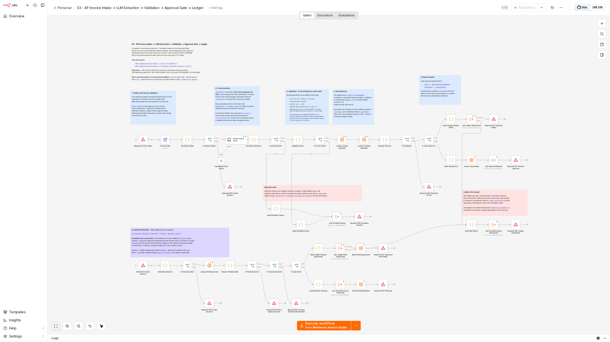
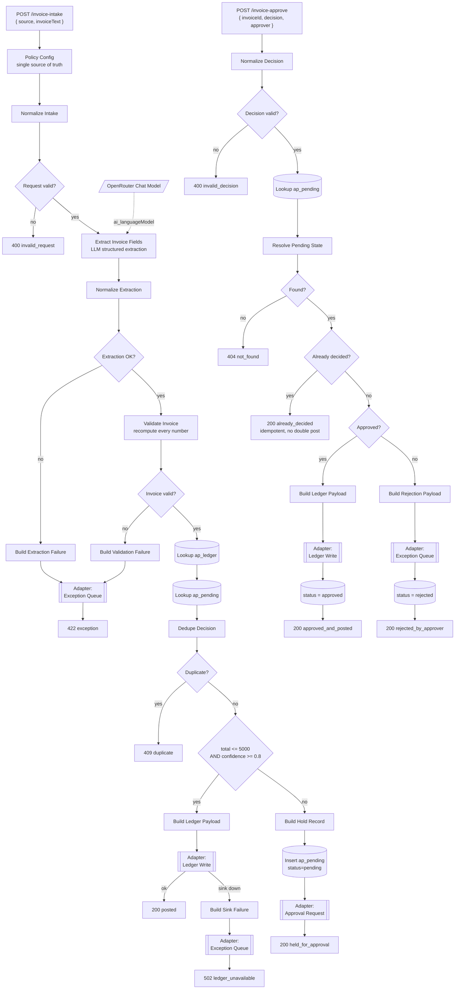
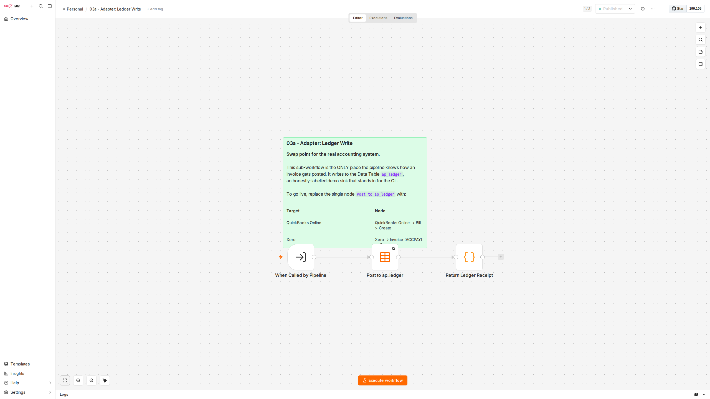
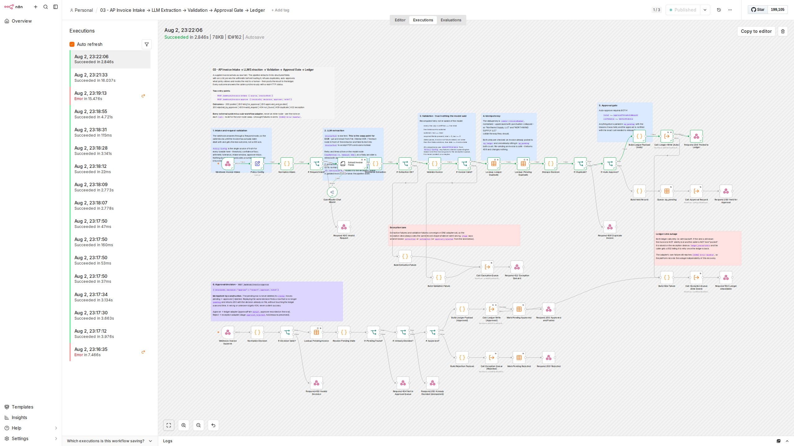

# 03 - AP Invoice Intake to Ledger

**Raw supplier invoice text in. A posted ledger entry, a human approval, or a documented exception out. Never a silent failure.**

An accounts-payable clerk's day is mostly retyping: open the email, read the PDF, key the vendor, key the lines, check the maths, decide whether it needs a signature, post it. This workflow does all of that except the deciding, and it refuses to post anything it cannot prove.

The interesting part is not the extraction. Any LLM will read an invoice. The interesting part is that **the pipeline does not trust what the model said** - it recomputes every number before the invoice is allowed near the ledger, and it can tell you in plain English why it refused.



---

## Contents

- [What it does](#what-it-does)
- [Flow](#flow)
- [The two entry points](#the-two-entry-points)
- [Engineering decisions worth defending](#engineering-decisions-worth-defending)
- [Adapters: the swap points](#adapters-the-swap-points)
- [Execution evidence](#execution-evidence)
- [What the business gets](#what-the-business-gets)
- [Running it yourself](#running-it-yourself)
- [Honest limitations](#honest-limitations)

---

## What it does

| Stage | What happens | Failure behaviour |
| --- | --- | --- |
| Intake | `POST /webhook/invoice-intake` with `{ source, invoiceText }` | Missing or too-short input returns **400** before a single token is spent |
| Extraction | Information Extractor over OpenRouter (`anthropic/claude-sonnet-4.6`) into a fixed JSON schema, including the model's own confidence | Provider flakiness retried inside the LLM client; a terminal failure routes to the exception queue, it does not throw |
| Validation | Every number recomputed - line maths, subtotal, tax, dates, required fields | Any failure routes to the exception desk with plain-English reasons, returns **422** |
| Idempotency | Dedupe on a normalised `vendor::invoiceNumber` against both the ledger and the pending queue | A repeat submission returns **409** and changes nothing |
| Approval gate | Auto-approve only if `total <= 5000` **and** `confidence >= 0.8` | Anything else is parked in `ap_pending` and the approver is notified, returns **200 held_for_approval** |
| Decision | `POST /webhook/invoice-approve` moves pending to approved or rejected | Idempotent - replaying a decision returns **200 already_decided** and never double-posts |
| Ledger | Posted through the ledger adapter | If the sink is down after retries, the invoice is raised as `ledger_unavailable` and the caller gets **502**, never a false "posted" |

---

## Flow



---

## The two entry points

### Intake

```bash
curl -X POST http://localhost:5678/webhook/invoice-intake \
  -H 'Content-Type: application/json' \
  -d '{
        "source": "ap-inbox@cascademfg.example",
        "invoiceText": "NORTHWIND INDUSTRIAL SUPPLY, LLC\nInvoice #: NW-2026-0451\n..."
      }'
```

```json
{
  "status": "posted",
  "approvalPath": "auto",
  "invoiceId": "NORTHWIND-INDUSTRIAL-SUPPLY-LLC::NW-2026-0451",
  "vendor": "Northwind Industrial Supply, LLC",
  "invoiceNumber": "NW-2026-0451",
  "currency": "USD",
  "total": 2892.13,
  "confidence": 0.99,
  "lineItemCount": 3,
  "extractionModel": "anthropic/claude-sonnet-4.6",
  "ledgerRef": "1",
  "sink": "n8n Data Table: ap_ledger (demo sink for the GL)",
  "postedAt": "2026-08-03T03:17:16.371Z"
}
```

### Approval

```bash
curl -X POST http://localhost:5678/webhook/invoice-approve \
  -H 'Content-Type: application/json' \
  -d '{"invoiceId":"MERIDIAN-FABRICATION-GROUP::MFG-88214",
       "decision":"approve","approver":"c.gentile",
       "note":"PO-CM-9042 matched, goods received 2026-06-05"}'
```

The approver does not have to compose that by hand. The approval adapter renders it for them - this is the actual body stored in `ap_notifications` during the run below:

```
Invoice MFG-88214 from Meridian Fabrication Group needs your approval.

Amount    : USD 10587.81
Due date  : 2026-07-17
Confidence: 0.99
Invoice ID: MERIDIAN-FABRICATION-GROUP::MFG-88214

Why it was held:
  - Invoice total USD 10587.81 exceeds the USD 5000 auto-approval threshold.

Approve:
  curl -X POST http://localhost:5678/webhook/invoice-approve -H 'Content-Type: application/json' \
    -d '{"invoiceId":"MERIDIAN-FABRICATION-GROUP::MFG-88214","decision":"approve","approver":"YOUR_NAME"}'

Reject:
  curl -X POST http://localhost:5678/webhook/invoice-approve -H 'Content-Type: application/json' \
    -d '{"invoiceId":"MERIDIAN-FABRICATION-GROUP::MFG-88214","decision":"reject","approver":"YOUR_NAME","note":"why"}'
```

---

## Engineering decisions worth defending

### The model extracts. It does not get to be right.

`Validate Invoice` recomputes everything the model reported:

- each line: `qty x unitPrice == lineTotal`
- all line totals sum to `subtotal`
- `subtotal + tax == total`
- required fields present, `total > 0`, `tax >= 0`
- dates parse, the invoice is not future-dated, not older than the intake window, and `dueDate >= invoiceDate`

All comparisons run against `amountTolerance` from `Policy Config`.

This is also why the extraction prompt explicitly forbids the model from fixing arithmetic: *"Never compute, correct or balance the numbers yourself. The downstream validator has to be able to detect an arithmetic error on the invoice, and it cannot do that if you silently fix it."* A helpful model that quietly corrects a supplier's bad maths destroys the only signal that the invoice is wrong.

Proven by execution 92 - a supplier invoice stating `subtotal 1000.00 + tax 62.50 = TOTAL 1200.00`:

```
Invoice total 1200 does not equal subtotal 1000 + tax 62.5 = 1062.5.
```

### Idempotency is structural, not best-effort

The dedupe key is `vendor::invoiceNumber` normalised to uppercase with punctuation collapsed, so `Northwind Supply, LLC` and `NORTHWIND SUPPLY LLC` collide as they should. Both the ledger and the pending queue are checked, because an invoice awaiting approval is just as much a duplicate as one already posted.

On the approval side the pending row is **never deleted** - its `status` moves `pending -> approved | rejected`. A replayed decision therefore finds a row that is no longer `pending`, and returns 200 with the decision already on file without touching the ledger a second time. Executions 89 and 91 are the same request sent twice: one ledger row, two clean 200s.

### Failure has a defined shape at every stage

| Failure | Where it goes | Caller sees |
| --- | --- | --- |
| Bad request | rejected before extraction | 400 with the specific field errors |
| LLM cannot produce a structured invoice | `ap_exceptions` stage `extraction` | 422 |
| Numbers do not reconcile | `ap_exceptions` stage `validation` | 422 |
| Approver rejects | `ap_exceptions` stage `approval_rejected`, hold reasons preserved | 200 `rejected_by_approver` |
| Ledger sink down after retries | `ap_exceptions` stage `ledger_unavailable` | 502, and `postedToLedger: false` |
| Anything uncaught | `[CORE] Error Handler` appends to `core_error_log` | - |

The last two matter most. An AP pipeline that answers `200 {"status":"posted"}` when the ledger write actually failed is worse than one that crashes, because the invoice is now invisible. Here the invoice is preserved on the exception desk, the caller is told the truth, **and** the platform error log still records the outage independently.

### Nothing is hardcoded twice

`Policy Config` is a single Set node holding every tunable - threshold, confidence floor, arithmetic tolerance, intake window, approver inbox, approval path. Every downstream node reads from it. Changing the auto-approval threshold is a one-field edit, not a search across expressions.

The model id is handled the same way in reverse: it lives only on the OpenRouter node, and `Normalize Extraction` reads it back with `$('OpenRouter Chat Model').params.model` so the audit trail records what actually ran rather than a literal that could drift out of sync. Every `ap_ledger` row carries the real `extractionModel`.

### Retries are where they can actually retry

Node-level `retryOnFail` only helps for nodes that throw. So:

- **LLM calls** retry inside the LangChain client (`maxRetries: 3`, `timeout: 60s`) - the Information Extractor itself is set to `continueRegularOutput` so a terminal failure becomes a routable `{ error }` item rather than a dead execution.
- **Data Table and sub-workflow calls** use node-level `retryOnFail` with `maxTries: 3` and a 2s backoff, because those genuinely throw.

The forced-outage run below shows all three retry attempts landing in `core_error_log` as separate adapter executions before the parent gave up and recovered.

### `maxTokens` is set deliberately, not left on the default

The OpenRouter node is capped at `maxTokens: 4096`. This matters more than it looks: n8n's LLM nodes default this to `-1` (unbounded), which makes the client request the model's full output ceiling. Providers validate available credit against the *requested* ceiling, not actual usage, so an unbounded node can return **402 Payment Required** on a request that would only have produced a few hundred tokens - and on a shared credential it starves every other workflow on the instance.

Measured on execution `185` (a two-line-item invoice):

| Metric | Tokens |
| --- | --- |
| Prompt | 999 |
| Completion | 237 |
| Total | 1,236 |

4096 is roughly 17x the observed completion size, which is deliberate headroom rather than waste: output scales with line-item count, and the cap needs to clear a long invoice without truncating mid-JSON. A truncated response would fail schema parsing and land the invoice in the exception queue - a graceful failure, but a false one. The cap is sized to the worst realistic invoice, not the average one.

---

## Adapters: the swap points

Every external system is a **sub-workflow**, never an inline node. The main pipeline only knows the input contract and the receipt it gets back, so swapping the real system never touches pipeline logic.

| Adapter | Demo sink | Swap the single node for | Contract returned |
| --- | --- | --- | --- |
| `03a - Adapter: Ledger Write` | Data Table `ap_ledger` | QuickBooks Online (Bill: Create), Xero (Invoice ACCPAY: Create), NetSuite/SAP via HTTP Request | `{ posted, ledgerRef, sink, postedAt }` |
| `03b - Adapter: Exception Queue` | Data Table `ap_exceptions` | Jira / ServiceNow (Issue: Create), Zendesk (Ticket: Create), Gmail, Slack | `{ queued, exceptionRef, stage, reasons, raisedAt }` |
| `03c - Adapter: Approval Request` | Data Table `ap_notifications` | Gmail, Slack, Microsoft Teams, or an approvals API | `{ notified, notificationRef, channel, recipient, sentAt }` |

The notification **rendering** stays put in every case - `Render Approval Notice` builds a channel-agnostic subject and body, and only the delivery node changes.

**The document-parse stage is the other swap point.** `invoiceText` is raw text today. Put an Extract from File, Mistral OCR, or Textract node in front of `Extract Invoice Fields` and feed its output into `invoiceText`, and the same pipeline accepts PDFs and scans with no other change.



---

## Execution evidence

Every row below is a real execution on n8n 2.32.7, driven over HTTP against the published workflow. Execution ids are live and inspectable at `GET /api/v1/executions/{id}`.

| # | Scenario | Exec | HTTP | Outcome | Side effect |
| --- | --- | --- | --- | --- | --- |
| 1 | Clean invoice, USD 2,892.13, 3 line items | `80` | 200 | `posted`, `approvalPath: auto` | `ap_ledger` row 1 |
| 2 | Same invoice resent | `84` | 409 | `duplicate`, `duplicateOf: ap_ledger` | none - nothing written |
| 3 | Invoice USD 10,587.81 (over threshold) | `85` | 200 | `held_for_approval` | `ap_pending` row 1, `ap_notifications` row 1 |
| 4 | Approval with `decision: "maybe"` | `87` | 400 | `invalid_decision` | none |
| 5 | Approval for an unknown invoice id | `88` | 404 | `not_found` | none |
| 6 | Approve the held invoice | `89` | 200 | `approved_and_posted`, `approvalPath: manual` | `ap_ledger` row 2, pending row 1 -> `approved` |
| 7 | **Replay the same approval** | `91` | 200 | `already_decided`, `idempotent: true` | **none - no second ledger row** |
| 8 | Invoice whose own maths is wrong | `92` | 422 | `exception`, stage `validation` | `ap_exceptions` row 1 |
| 9 | Garbage text, not an invoice | `94` | 422 | `exception`, stage `validation`, 6 reasons | `ap_exceptions` row 2 |
| 10 | Missing `source`, 9-char `invoiceText` | `96` | 400 | `invalid_request` | none - **no LLM call made** |
| 11 | Invoice USD 9,504.00 (over threshold) | `104` | 200 | `held_for_approval` | `ap_pending` row 2, `ap_notifications` row 2 |
| 12 | Approver **rejects** it | `106` | 200 | `rejected_by_approver`, `postedToLedger: false` | `ap_exceptions` row 3, pending row 2 -> `rejected` |
| 13 | Clean invoice USD 972.00 | `117` | 200 | `posted` | `ap_ledger` row 3 |
| 14 | **Ledger sink forced down** | `154` | 502 | `ledger_unavailable` | `ap_exceptions` row 4 + 3 `core_error_log` rows |
| 15 | Same invoice retried after recovery | `162` | 200 | `posted` | `ap_ledger` row 4 |

### Regression sweep after the final republish

The workflow was republished once more after a canvas layout fix. Because a republish is a change, the core paths were re-proven rather than assumed:

| # | Scenario | Exec | HTTP | Outcome |
| --- | --- | --- | --- | --- |
| 16 | Fresh clean invoice, USD 1,527.12 | `185` | 200 | `posted` - `ap_ledger` row 5 |
| 17 | Same invoice resent | `187` | 409 | `duplicate` of `ap_ledger` row 5 |
| 18 | Empty body `{}` | `188` | 400 | `invalid_request`, both missing fields named |
| 19 | Replay of the Atlas rejection from run 12 | `189` | 200 | `already_decided`, `decisionOnFile: rejected` |

### Adapter sub-workflow executions

`03a - Adapter: Ledger Write`: `81`, `90`, `120`, `163` success; `126`, `128`, `130`, `155`, `157`, `159` error (the two forced-outage runs, three retry attempts each).
`03b - Adapter: Exception Queue`: `93`, `95`, `107`, `161` success.
`03c - Adapter: Approval Request`: `86`, `105` success.

### Forced-failure evidence: `core_error_log`

Test 14 pointed the ledger adapter's Data Table at `THIS_TABLE_DOES_NOT_EXIST`. Rows written to the shared `core_error_log` table by `[CORE] Error Handler`:

| Row | Workflow | Node | Exec | Message |
| --- | --- | --- | --- | --- |
| 20 | `03a - Adapter: Ledger Write` | Post to ap_ledger | 155 | `Could not find the data table: 'THIS_TABLE_DOES_NOT_EXIST'` |
| 21 | `03a - Adapter: Ledger Write` | Post to ap_ledger | 157 | same - retry 2 |
| 22 | `03a - Adapter: Ledger Write` | Post to ap_ledger | 159 | same - retry 3 |

Three rows for one request is the retry policy working, visible. The **parent** execution `154` is `success`, not `error`, because it caught the sink failure and recovered into a 502 - while the adapter's own failure still reached the shared error handler. That separation is the design: the platform records the outage, the caller still gets a truthful answer, and the invoice is not lost.

An earlier run of the same test (execution `125`, before the sink-outage lane existed) is left in the history as `error` with `core_error_log` rows 15-18. At that point the caller received an empty 200 - which is exactly the defect the 502 lane was added to fix.



### Final state of the data tables

```
ap_ledger (5 rows)
  #1 Northwind Industrial Supply, LLC  NW-2026-0451  USD  2892.13  auto    policy:auto-approve
  #2 Meridian Fabrication Group        MFG-88214     USD 10587.81  manual  c.gentile
  #3 Summit Gasket Works               SGW-5109      USD   972.00  auto    policy:auto-approve
  #4 IRONGATE TOOL & DIE               ITD-3388      USD  2008.80  auto    policy:auto-approve
  #5 Cascade Abrasives Co.             CAB-9001      USD  1527.12  auto    policy:auto-approve

ap_pending (2 rows)
  #1 MFG-88214  approved  c.gentile  "PO-CM-9042 matched, goods received 2026-06-05"
  #2 AP-77310   rejected  c.gentile  "No purchase order on file and receiving has no record of delivery"

ap_exceptions (4 rows)
  #1 validation          Pioneer Valve & Fitting Co.  total 1200.00 does not equal 1000.00 + 62.50
  #2 validation          (unparseable)                6 reasons, no dedupe key derivable
  #3 approval_rejected   Atlas Polymer Solutions      rejection reason + original hold reason preserved
  #4 ledger_unavailable  IRONGATE TOOL & DIE          sink refused after all retries, NOT posted
```

---

## What the business gets

These are the numbers this pipeline makes computable from its own tables. The figures below come from the 19 executions above - a demonstration sample, not a benchmark.

**Value posted without a human touching it.** Split by `approvalPath` on `ap_ledger`:

| Path | Invoices | Value |
| --- | --- | --- |
| `auto` | 4 | USD 7,400.05 |
| `manual` | 1 | USD 10,587.81 |
| **Total posted** | **5** | **USD 17,987.86** |

Four of five invoices cleared with no human involvement at all. The one that needed a signature got one, and the ledger records who gave it. Note the asymmetry: 80 percent of invoices auto-cleared but only 41 percent of the value, because the threshold deliberately routes the expensive ones to a person. In a real AP function the threshold is the lever - raising `approvalThresholdAmount` moves value from the manual column to the auto column, and the confidence floor is what stops that from becoming reckless.

**Exception rate.** Eleven well-formed invoices were submitted to `/invoice-intake` across both runs. Three landed on the exception desk directly - two rejected on their own arithmetic or unreadability, one blocked by the sink outage - and a fourth arrived later when the approver rejected a held invoice. Every one carries machine-readable `reasons`, so `stage` on `ap_exceptions` gives an exception rate broken down by cause:

| `stage` | Rows | Meaning |
| --- | --- | --- |
| `validation` | 2 | the invoice failed its own arithmetic or could not be read |
| `approval_rejected` | 1 | a human declined it, with the reason recorded |
| `ledger_unavailable` | 1 | infrastructure, not the invoice - safe to replay |

That breakdown is the useful part. The two `validation` rows are invoices that would otherwise have become a manual investigation with no starting point, and the `ledger_unavailable` row is explicitly *not* a bad invoice, so it can be retried in bulk once the sink recovers - which is exactly what execution `162` did.

**Approval latency.** `ap_pending` stores `queuedAt` and `decidedAt` on every held invoice, so approval SLA is a subtraction, not a guess:

| Invoice | Queued | Decided | Latency | Outcome |
| --- | --- | --- | --- | --- |
| MFG-88214 | 03:17:37.219Z | 03:17:50.608Z | 13.4s | approved |
| AP-77310 | 03:18:31.535Z | 03:18:31.652Z | 0.1s | rejected |

Those durations are meaningless as an SLA - the approver was a curl command running seconds later. What they demonstrate is that **the fields to compute a real SLA exist and are populated**, which is the part that is usually missing when someone asks "how long are we sitting on invoices?" and nobody can answer.

**The part that is hardest to price:** every refusal is explained. "Invoice total 1200 does not equal subtotal 1000 + tax 62.5 = 1062.5" is a sentence a clerk can act on in seconds, and a sentence you can put in an email to the supplier. That is the difference between an exception queue that gets worked and one that grows.

---

## Running it yourself

### Import

```bash
# workflows/
03-ap-invoice-pipeline.json        # main pipeline (50 nodes + 9 sticky notes)
03a-adapter-ledger-write.json      # ledger sink adapter
03b-adapter-exception-queue.json   # exception desk adapter
03c-adapter-approval-request.json  # approver notification adapter
```

Credential ids are stripped from the exports. After importing you must:

1. Attach an **OpenRouter** credential to the `OpenRouter Chat Model` node (the credential *type* `openRouterApi` is preserved, only the id is removed).
2. Create the Data Tables `ap_ledger`, `ap_pending`, `ap_exceptions`, `ap_notifications` and re-point each Data Table node's `dataTableId` at your own table ids - the exported ids belong to the instance this was built on.
3. Re-point the three `Call:` nodes at your imported sub-workflow ids.
4. Set `settings.errorWorkflow` to your own shared error-handler workflow (the export references `[CORE] Error Handler`).
5. Publish all four workflows. In n8n 2.x this is `POST /api/v1/workflows/{id}/activate`.

### Data Table schemas

| Table | Purpose | Key columns |
| --- | --- | --- |
| `ap_ledger` | posted invoices - the GL stand-in | `invoiceId`, `vendor`, `invoiceNumber`, amounts, `lineItems` (JSON string), `approvalPath`, `approver`, `extractionModel`, `postedAt` |
| `ap_pending` | approval queue | as above plus `status`, `holdReasons`, `queuedAt`, `decidedAt`, `decisionNote` |
| `ap_exceptions` | exception desk | `stage`, `reasons` (JSON string), `rawExcerpt`, `raisedAt` |
| `ap_notifications` | approver notifications | `channel`, `recipient`, `subject`, `body`, `approveUrl`, `sentAt` |

Note: n8n Data Table columns accept `string | number | boolean | date` only. The public OpenAPI spec advertises a `json` type, but the runtime validator rejects it - array fields are therefore stored as JSON strings and parsed at the boundary.

### Tuning

Everything lives on the `Policy Config` node:

| Field | Default | Effect |
| --- | --- | --- |
| `approvalThresholdAmount` | 5000 | invoices at or below this can auto-approve |
| `minConfidence` | 0.8 | extraction confidence floor for auto-approval |
| `amountTolerance` | 0.02 | rounding slack on every arithmetic check |
| `maxInvoiceAgeDays` | 365 | invoices older than this are rejected as stale |
| `minInvoiceTextLength` | 40 | shorter payloads are rejected before any LLM spend |
| `approverInbox` | `ap-approvals@example.com` | where the approval request is sent |

---

## Honest limitations

This is a portfolio demonstration on a local n8n instance. What is genuinely built and proven is listed above with execution ids. What is **not** production-ready:

- **The sinks are demo sinks.** `ap_ledger` is a Data Table, not a general ledger. It is labelled as such in every response body (`"sink": "n8n Data Table: ap_ledger (demo sink for the GL)"`) so nothing here can be mistaken for a real posting. The adapter pattern is what makes the swap a one-node change - that claim is structural, but the QuickBooks and Xero swaps themselves have not been executed against live accounts.
- **The approval webhook is unauthenticated.** Anyone who can reach `/webhook/invoice-approve` can approve an invoice. In production this needs header auth or a signed single-use token in `approveUrl` at minimum. The pipeline records *who claimed* to approve, not who actually did.
- **Dedupe is not race-safe.** Two identical invoices arriving in the same instant could both pass the lookup before either writes. A production version needs a unique constraint at the storage layer, which n8n Data Tables do not currently offer.
- **Confidence is self-reported.** The model grades its own extraction. It is a useful signal and it correctly collapsed on the garbage input, but it is not a calibrated probability, and every clean invoice in this run self-reported 0.99. Treat the confidence gate as a coarse filter, not a guarantee.
- **No PO or receipt matching.** Real AP does three-way matching against purchase orders and goods-received notes. This pipeline validates the invoice against itself only. The rejected Atlas Polymer invoice was caught by a human noticing there was no PO - the workflow could not have known.
- **Approval latency figures are demonstration artifacts**, as noted above.

---

*Built on n8n 2.32.7. Extraction via OpenRouter (`anthropic/claude-sonnet-4.6`). All execution ids in this document are real and were produced by HTTP calls against the published workflow.*
