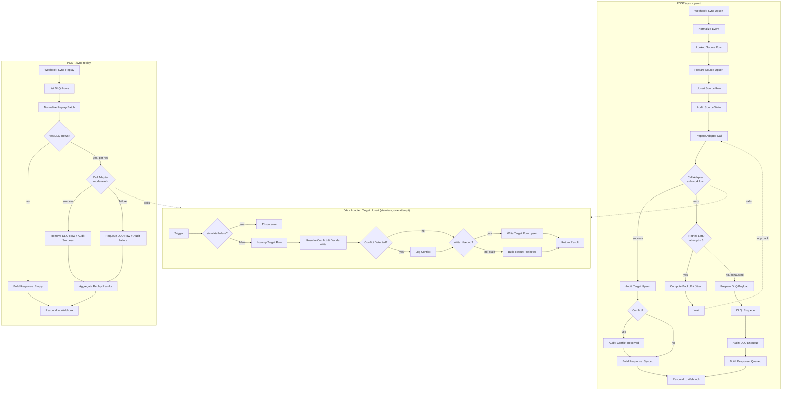

# 04 — Resilient Cross-System Data Sync

Bidirectional contact sync between two systems (System A and System B) with idempotent writes, deterministic conflict resolution, exponential-backoff retries with jitter, a dead-letter queue with a replay endpoint, and a full audit trail of every mutation. Built to demonstrate the reliability patterns a production integration between a CRM, a database, and a spreadsheet actually needs — not just the happy path.

n8n 2.32.7. Two workflows: the orchestrator (`04 - Resilient Cross-System Data Sync`) and a stateless adapter sub-workflow (`04a - Adapter: Target Upsert`) that performs exactly one write attempt per call.

## Why this exists

Most "integration" demos show data moving in one direction, once, assuming nothing ever fails. Real syncs run against flaky APIs, get edited on both ends at once, and need someone to be able to answer "did event X actually land, and if not, why not?" months later. This workflow is a small, inspectable model of the machinery that answers those questions: idempotency keys, a deterministic conflict rule, backoff with jitter instead of hammering a failing dependency, a dead-letter queue instead of silently dropping failed writes, and an audit log instead of hoping the logs are still around.

## Architecture

Data Tables: `sync_system_a`, `sync_system_b` (`externalId, name, email, phone, sourceUpdatedAt`), `sync_conflicts`, `sync_dlq`, `sync_audit`. All namespaced `sync_`, no credentials used anywhere in either workflow.

## Reliability patterns, and where they live

**Idempotency.** Every write is a `dataTable.upsert` keyed on `externalId` — never a blind insert. Each event also carries an `idempotencyKey` (`sourceSystem->targetSystem:externalId:sourceUpdatedAt`) that's written into `sync_audit` alongside every mutation, so a duplicate delivery of the same event is traceable and converges to the same row state instead of creating a second one. Replaying a DLQ row is the same guarantee applied at the queue level: the row's `dlqId` is the unit of replay, success deletes it, and re-running it never double-applies because the target write is still an upsert.

**Deterministic conflict resolution.** The adapter sub-workflow (`04a`) looks up the existing target row before writing. If nothing exists, it's a plain insert — no conflict. If a row already exists, that's treated as a conflict by definition: both versions are compared by `sourceUpdatedAt`, the newer one wins (last-write-wins), and **both** the winning and losing versions are written to `sync_conflicts` with the resolution strategy recorded, regardless of which side won. When the incoming write is older than what's already there, it's rejected outright — the target keeps its current value and the stale write never lands (proved below with an explicitly backdated timestamp, not a timing race, so the outcome is repeatable).

One deliberate, documented nuance: a system's write to its **own** table is always accepted (a system is always the source of truth for itself). Conflict resolution only gates *propagation* to the other system. That means the two tables can briefly hold different values for the same contact when a stale edit is rejected on one side — which is correct, not a bug: it's exactly the signal that a conflict happened, and it's sitting in `sync_conflicts` for someone to look at.

**Exponential backoff with jitter.** The "Prepare Adapter Call" node is the loop anchor: on adapter failure, `Compute Backoff + Jitter` calculates `wait = base(2s) * 2^attempt + random(0, 1s)`, a `Wait` node sleeps, and the flow loops back to `Prepare Adapter Call` with the attempt counter incremented — up to 3 retries (4 attempts total) before giving up. This is a manual n8n loop (node output wired back to an earlier node), not the built-in per-node retry setting, specifically because n8n's built-in retry is fixed-delay only and can't do exponential+jitter.

**Dead-letter queue with replay.** When retries are exhausted, the full payload (target/source system, contact, `simulateFailure` flag, idempotency key), attempt count, and last error are written to `sync_dlq`. `POST /sync-replay` drains it: each row gets exactly one more attempt (not another 3x retry loop — replay is an explicit, operator-triggered retry, not automatic backoff), success deletes the row, failure increments `attempts` and leaves the row queued for the next replay call.

**Audit trail.** Every mutation-adjacent event — source write, target insert/update, stale rejection, conflict resolution, DLQ enqueue, DLQ replay success/failure — writes a row to `sync_audit` with `before`/`after` JSON snapshots, the actor, and the idempotency key. Nothing mutates silently.

**Sub-workflow isolation.** The adapter is intentionally stateless and does exactly one attempt per call — no retry logic inside it. That keeps the retry/backoff/DLQ machinery in exactly one place (the orchestrator) and makes the adapter trivially reusable from both the upsert flow and the replay flow.

## Execution evidence

All runs below are real executions against the live n8n instance (workflow `1zQXfpbP5gQ4DnB3`, adapter `AQQjamDLdNbjyLe9`), fetched via `GET /api/v1/executions`. No mocks, no manual DB edits except the one explicitly called out (simulating a transient condition clearing, step 6).

| # | Scenario | Call | Result | Execution id(s) |
|---|---|---|---|---|
| 1 | Normal insert, A→B | `POST /sync-upsert {system:"a", contact: cust-001}` | `status:"synced", action:"insert", conflict:false` | 98, 99, 100 |
| 2 | Normal update propagation, B→A | `POST /sync-upsert {system:"b", contact: cust-001 edited}` | `action:"update", conflict:true` — existing row found, newer write wins, both versions logged | 102, 103 |
| 3 | Deterministic stale rejection | A creates cust-002 at T0; B sends an edit explicitly timestamped T0 − 2h | `action:"rejected-stale", conflict:true` — A's newer row wins, B's stale edit rejected, both versions in `sync_conflicts` | 108, 109, 110, 111 |
| 4 | Transient failure → retry → DLQ | `POST /sync-upsert {..., simulateFailure:true}` (cust-003) | 3 retries then `status:"queued_dlq", attempts:3` | 112 (+ sub-executions 113, 115, 118, 122) |
| 5 | Replay while still failing | `POST /sync-replay` (DLQ payload still has `simulateFailure:true`) | `outcome:"replayed_failure_requeued"`, `attempts` 3→4, row retained | 134 (+ 135) |
| 6 | Condition clears, replay succeeds | Patched the DLQ row's stored payload (`simulateFailure:false`) via the Data Table API, then `POST /sync-replay` | `outcome:"replayed_success"`, row propagated to system B, DLQ row deleted | 145 (+ 146) |
| 7 | Empty-DLQ replay | `POST /sync-replay` called before any DLQ rows existed | `status:"no_dlq_rows", drained:0` | (early run, before executions above) |

**Backoff timing observed (execution 112, "Wait (Backoff + Jitter)" node):**

| Retry | Formula (`2s * 2^attempt + jitter[0,1)`) | Observed wait |
|---|---|---|
| attempt 0 → 1 | 2.0 – 3.0s | 2.009s |
| attempt 1 → 2 | 4.0 – 5.0s | 4.680s |
| attempt 2 → 3 | 8.0 – 9.0s | 8.692s |

Total elapsed for the failing call end-to-end (webhook received → `queued_dlq` response): 15.7s, matching the sum of the three waits plus node execution overhead. All three fall inside the expected exponential-backoff-with-jitter window, confirming both the formula and that the manual retry loop's node-reference resolution (`$('Prepare Adapter Call')`) stays correct across cycles — this was the one part of the design that genuinely needed empirical proof rather than just reading the n8n source, and it held up.

**`sync_audit` after the full run above (14 rows):** every source write, target insert/update, stale rejection, conflict resolution, DLQ enqueue, and both DLQ replay outcomes is present with `before`/`after` snapshots — nothing in the scenario list above happened without a corresponding audit row.

## Business framing

- **Zero-duplicate guarantee.** Because every write is an upsert keyed on a stable business identifier, and every DLQ replay is idempotent by construction, retrying a failed call — automatically or by hand — can never create a duplicate record on either side. That's the difference between "the integration retried and it's fine" and "the integration retried and now support is fielding duplicate-contact tickets."
- **Recovery time.** A transient failure (rate limit, momentary network blip, downstream maintenance window) self-heals within the retry window — about 15 seconds in this configuration (2s/4s/8s + jitter) — with zero operator involvement. A failure that persists past 3 attempts doesn't get silently dropped: it's a `sync_dlq` row with full context (payload, attempt count, last error), replayable on demand once the underlying issue is confirmed resolved, with no manual re-entry of data.
- **Auditability.** `sync_audit` and `sync_conflicts` together answer "what happened to record X" for any contact, at any point — which system wrote it, whether it collided with a concurrent edit, which version won and why, and whether it ever needed a retry. That's the artifact a support or compliance conversation actually needs, not a log line that rotated out three weeks ago.

## Swap-in mapping — from Data Table stand-ins to real systems

| This demo | Production equivalent | What changes |
|---|---|---|
| `sync_system_a` / `sync_system_b` (Data Table) | HubSpot (CRM) / Postgres (app DB), or any two systems of record | Replace the `Lookup *`/`Upsert *` Data Table nodes with the vendor's node or an HTTP Request call (HubSpot contacts API, a Postgres upsert). The idempotency and conflict-resolution logic in `04a` is system-agnostic — it only needs a `get-by-externalId` and a `write` primitive from each side. |
| `sync_dlq` (Data Table) | A durable queue (SQS, a `failed_jobs` Postgres table, or n8n's own error workflow + a queue) | Same shape (payload, attempts, last error) works against any of these; the `Requeue`/`Remove` operations become queue-native operations instead of Data Table rows. |
| `sync_conflicts` / `sync_audit` (Data Table) | A dedicated audit table in the app DB, or a log sink (e.g. Datadog/Postgres) with structured fields | No logic changes — just point the `insert` operations at the real sink. |
| `sourceUpdatedAt` comparison | The vendor's own `updatedAt`/`lastModifiedDate` field | HubSpot and most CRMs expose this natively; for spreadsheets (Google Sheets) you'd need to stamp it yourself on every edit, since Sheets has no reliable last-modified-per-row field out of the box. |
| Manual retry loop (Wait + IF + loop-back) | Same, or a proper queue's native retry/backoff (SQS visibility timeout + DLQ redrive policy) | If system B becomes a real message queue, its native backoff config can replace this loop entirely — the pattern demonstrated here is what to build when the target *doesn't* give you that for free. |

## Files

- `workflows/04-resilient-data-sync.json` — orchestrator (credential-free)
- `workflows/04a-adapter-target-upsert.json` — adapter sub-workflow (credential-free)
- `docs/img/04-main-canvas.png`, `docs/img/04a-adapter-canvas.png` — canvas screenshots
- `docs/img/04-execution-retry-dlq.png`, `docs/img/04-execution-replay-success.png`, `docs/img/04-executions-list.png` — execution screenshots

## What's proven vs. not yet captured

Proven by real execution (cited above): idempotent upsert on both systems, deterministic last-write-wins conflict resolution (both the "incoming wins" and "existing wins / stale rejected" branches), exponential backoff with jitter with observed timing matching the formula, DLQ enqueue, DLQ replay both failing-and-requeuing and succeeding-and-draining, and a complete audit trail across every scenario.

Not included: an LLM-generated conflict-summary note (mentioned as optional in the brief) — skipped to keep the reliability-engineering scope tight; the `sync_conflicts` rows already carry both full versions in structured form, which is more useful for a portfolio reviewer to inspect directly than a paraphrase would be.
